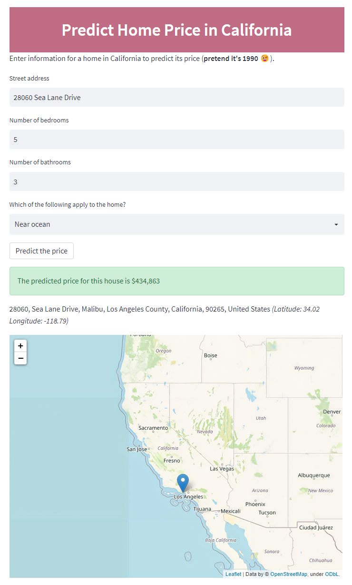
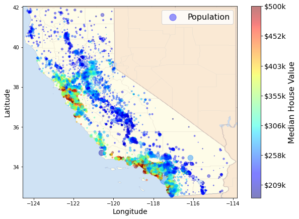
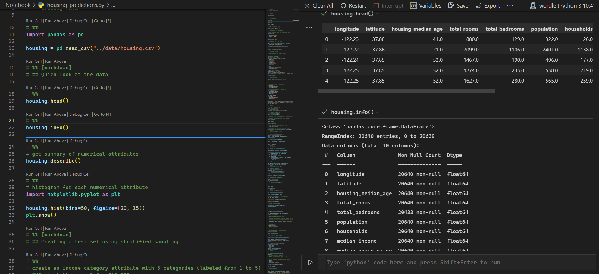
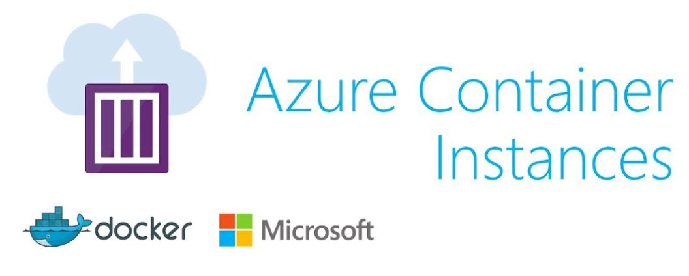

---
# Quick overview
1. Why would I use notebooks in VS Code?
2. How do I create my ML app?
3. How do I containerize by ML app?
4. How do I deploy my ML app?
<br><br>
Cover all without leaving VS Code 😉



---
<!-- _class: lead -->
# Why use notebooks in VS Code?
- Extension marketplace
- Debugging
- Embedded git control
- IntelliSense
- Integrated terminal
- First-class Python support
- Code refactoring
- Highly customizable (themes, keyboard shortcuts)

## Code editor + [Jupyter Notebooks](https://marketplace.visualstudio.com/itemdetails?itemName=ms-toolsai.jupyter) = ❤️

---
## Starting a notebook in VS Code is a _little_ different

| Classic Jupyter Notebooks | Notebooks in VS Code |
|:-------------------------:|:--------------------:|
| Create a Python environment<br>`conda create -n myenv`</br></br> | Create a Python environment<br>`conda create -n myenv`</br></br>|
| Activate the Python environment<br>`conda activate myenv`</br></br> | Open VS Code<br>`code .`</br></br> |
| Launch Jupyter Notebooks<br>`jupyter notebook`</br></br> | Select a Python environment</br></br>|

---
<br><br><br><br>

# California housing prediction

### Goal of Analysis: Use ML algorithms to get best accuracy of predictions for California housing prices (in 1990) given the attributes in the dataset.

(Link to the [dataset](https://www.kaggle.com/camnugent/california-housing-prices))

---
# Notebook contents
- Quick look at the data
- Data visualization
- Data cleaning
- ML training and evaluating
- ML model export

###### _Attribute the content of this notebook to [Hands-on Machine Learning with Scikit-Learn, Keras & Tensorflow](https://github.com/ageron/handson-ml2) by Aurelien Geron_



---
# Let's talk about __Interactive Window__

> Essentially, it's an advanced Python REPL playground

> Treat parts of py code as cells using `# %%`



---
# How do I create an ML web app?


---
# How do I deploy my ML web app?
1. Create a Dockerfile
2. Build the container image and push to a registry (e.g. Azure Container Registry)
3. Deploy the container image on the registry to ACI  (Azure Container Instances)
<br>



<!-- ---
```python
```

---
 -->

---
