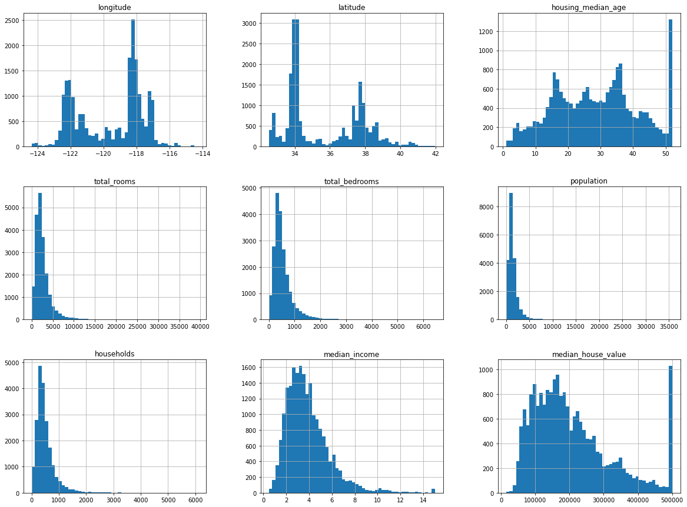

<br><br><br><br>

# California housing prediction

### Goal of Analysis: Use ML algorithms to get best accuracy of predictions for California housing prices given the attributes in the dataset.

(Link to the [dataset](https://www.kaggle.com/camnugent/california-housing-prices) for California housing pricesc in 1990)

---
## Data
- Histogram of the raw data
- Quick view of the data before doing further analysis
- Generated automatically from a data frame using `matplotlib`



---
```python
    # visualize data based on geographical info
    import matplotlib.image as mpimg
    import matplotlib.pyplot as mppyplot

    california_img=mpimg.imread('./images/california.png')
    ax = housing.plot(kind="scatter", x="longitude", y="latitude", figsize=(10,7),
                    s=housing['population']/100, label="Population",
                    c="median_house_value", cmap=plt.get_cmap("jet"),
                    colorbar=False, alpha=0.4)
    plt.imshow(california_img, extent=[-124.55, -113.80, 32.45, 42.05], alpha=0.5,
            cmap=plt.get_cmap("jet"))
    plt.ylabel("Latitude", fontsize=14)
    plt.xlabel("Longitude", fontsize=14)

    prices = housing["median_house_value"]
    tick_values = np.linspace(prices.min(), prices.max(), 11)
    cbar = plt.colorbar(ticks=tick_values/prices.max())
    cbar.ax.set_yticklabels(["$%dk"%(round(v/1000)) for v in tick_values], fontsize=14)
    cbar.set_label('Median House Value', fontsize=16)

    plt.legend(fontsize=16)
    plt.show()
```
---

<!--  -->