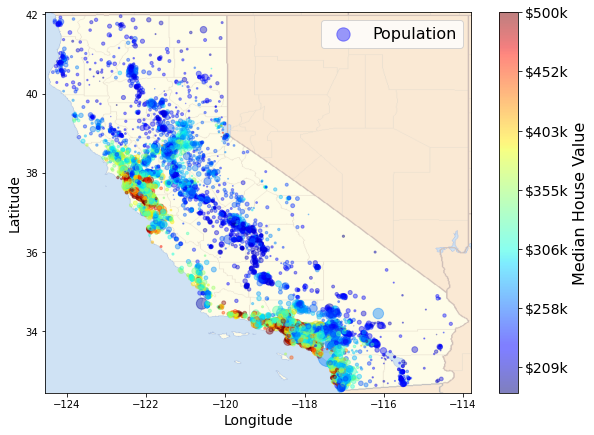

## Visualizing data for insights
Data visualization for the data we have<!-- .slide: data-fullscreen -->

---

---

| -124.35 | 40.54 | 52 | 1820 | 300 | 806  | 270 | 3.01 | 94600  | NEAR OCEAN |
|---------|-------|----|------|-----|------|-----|------|--------|------------|
| -124.3  | 41.8  | 19 | 2672 | 552 | 1298 | 478 | 1.98 | 85800  | NEAR OCEAN |
| -124.3  | 41.84 | 17 | 2677 | 531 | 1244 | 456 | 3.03 | 103600 | NEAR OCEAN |
| -124.27 | 40.69 | 36 | 2349 | 528 | 1194 | 465 | 2.52 | 79000  | NEAR OCEAN |